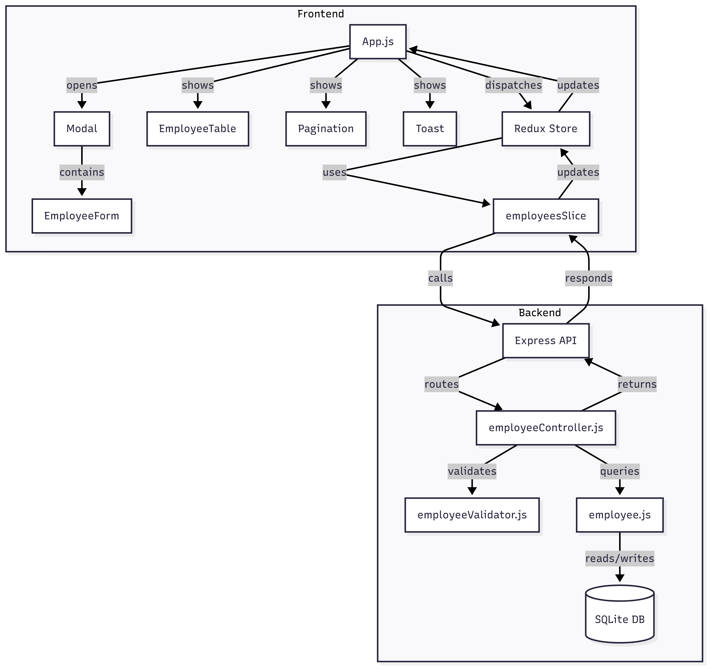

# Employee Management System

A Employee Management System with a Node.js/Express/SQLite backend and a React/Redux frontend. The app supports CRUD operations, validation, pagination, and search for employee records.
---

## Features
- Add, edit, delete, and view employees
- Paginated employee list
- Search employees by name, email, or position
- Form validation (frontend and backend)
- Toast notifications for actions and errors
- Modular code structure (MVC backend, component-based frontend)
- Redux Toolkit for state management and async logic

## Backend (Node.js/Express/SQLite)

### 1. Directory Structure
```
backend/
  controllers/
    employeeController.js
  models/
    db.js
    employee.js
  routes/
    employeeRoutes.js
  validators/
    employeeValidator.js
  server.js
  seedEmployees.js
  employees.db
  package.json
```

### 2. Main Components
- **server.js**: Entry point, sets up Express app, middleware, and routes.
- **controllers/employeeController.js**: Handles business logic for employee CRUD, pagination, and validation.
- **models/db.js**: SQLite DB connection and initialization.
- **models/employee.js**: DB queries for employee CRUD and pagination.
- **routes/employeeRoutes.js**: Express routes for RESTful API endpoints.
- **validators/employeeValidator.js**: Joi schema for employee data validation.

### 3. API Endpoints
- `GET /api/employees?page=&pageSize=`: List employees (paginated)
- `POST /api/employees`: Add employee
- `PUT /api/employees/:id`: Update employee
- `DELETE /api/employees/:id`: Delete employee

---

## Backend Setup
1. Open a terminal and navigate to the `backend` folder:
   ```sh
   cd backend
   ```
2. Install dependencies:
   ```sh
   npm install
   ```
3. (Optional) Seed the database with sample employees:
   ```sh
   node seedEmployees.js
   ```
4. Start the backend server:
   ```sh
   npm start
   ```
   The backend will run on [http://localhost:4000](http://localhost:4000)

---


## Frontend (React/Redux)

### 1. Directory Structure
```
frontend/
  src/
    components/
      Modal.js
      Pagination.js
      Toast.js
    features/
      employees/
        EmployeeForm.js
        EmployeeTable.js
    slices/
      employeesSlice.js
    App.js
    App.css
    store.js
    ...
```

### 2. Main Components
- **App.js**: Main container, manages modal, search, pagination, and toast state.
- **EmployeeTable.js**: Displays employee list, edit/delete actions.
- **EmployeeForm.js**: Form for add/edit employee.
- **Modal.js**: Generic modal wrapper.
- **Pagination.js**: Pagination controls.
- **Toast.js**: Notification messages.
- **employeesSlice.js**: Redux slice for employee state, async thunks for API calls.
- **store.js**: Redux store setup.


---

## Frontend Setup
1. Open a new terminal and navigate to the `frontend` folder:
   ```sh
   cd frontend
   ```
2. Install dependencies:
   ```sh
   npm install
   ```
3. Start the frontend app:
   ```sh
   npm start
   ```
   The frontend will run on [http://localhost:3000](http://localhost:3000)

---

## Usage
- Open [http://localhost:3000](http://localhost:3000) in your browser.
- Use the **Add Employee** button to add new employees.
- Use the search bar to filter employees.
- Edit or delete employees using the table actions.
- Use pagination controls to navigate through the list.

---

## Testing
### Backend
- From the `backend` folder, run:
  ```sh
  npm test
  ```


## Technologies Used
- **Backend:** Node.js, Express, SQLite, 
- **Frontend:** React, Redux Toolkit, Axios


## Features
- **Separation of concerns**: Controllers, models, and routes are modular.
- **Validation**: All input validated server-side.
- **Redux Toolkit**: Simplifies async logic and state management.
- **Component Reuse**: Modal, Toast, Pagination are generic and reusable.
- **Client-side Search**: Fast, no backend load for small datasets.

---

## Future Scope
- Backend can add filtering/search endpoints for large datasets.
- Frontend can add role-based access, advanced filters, or export features.

---

## Author
- Vineet Sakpal
---



